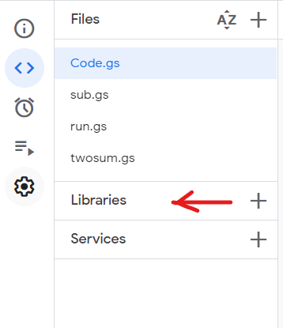
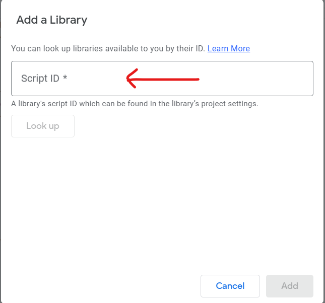
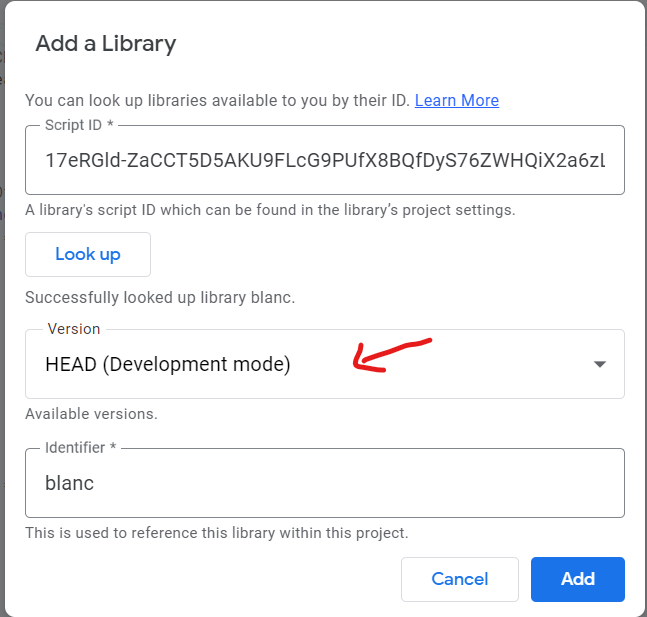

# Blanc (Apps Script Library)

## Background

Last year while working for infamy, I found myself writing and rewriting certain code snippets repeated on different Apps Script files. 

I decided to write a library That I can import into my projects when I start. This has been a game changer for me. I hope someone else will find value in this library.

## What is this Library?

This is a library that has a few functions that I use regular for Apps Script Development. This library creates a shorthand way of writing thing certain functions.

## How do I install this Library in Apps Script?

1. Copy this ID `17eRGld-ZaCCT5D5AKU9FLcG9PUfX8BQfDyS76ZWHQiX2a6zLlhz8yXPW`
2. Go to your [Apps Script File](https://script.google.com/home) or a [New Apps Script File](https://script.new)
3. In the Editor Tab, you should see a left panel with a section called Libraries.
   
    

4. Click on the **+** Icon to add this libary to your Apps Script.
5. A pop up should show like the one below.

6. Paste this Script ID `17eRGld-ZaCCT5D5AKU9FLcG9PUfX8BQfDyS76ZWHQiX2a6zLlhz8yXPW` in the input section.
7. Click on **Lookup** you should be able to see the versions that exist in the project.
   

8. Select the version with the highest number (Recommended).
9. Click on **Add**
10. You are ready to go.

## How do I use the Library?

To use the functions in the library type.

`blanc.[function name]`

### For Example

`blanc.filterByDate(array,col,startDate,endDate)`

## To see how each function works, see our [Documentation](https://github.com/Hemephelus/blanc/blob/main/Documentation.md).

    

